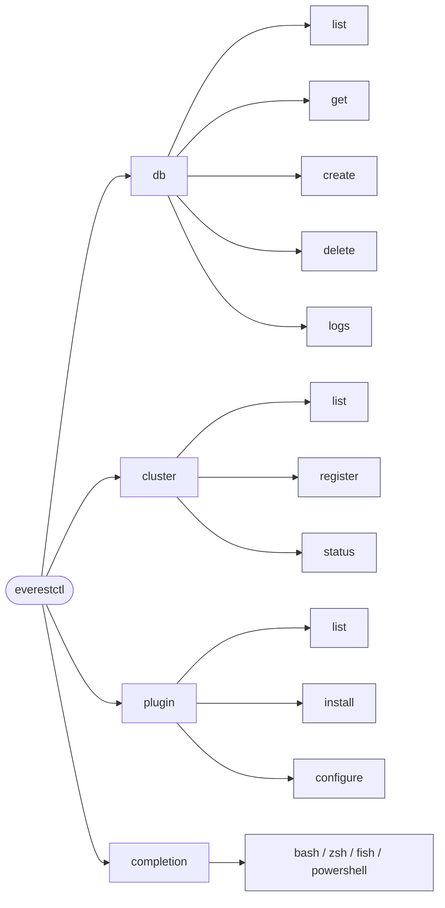
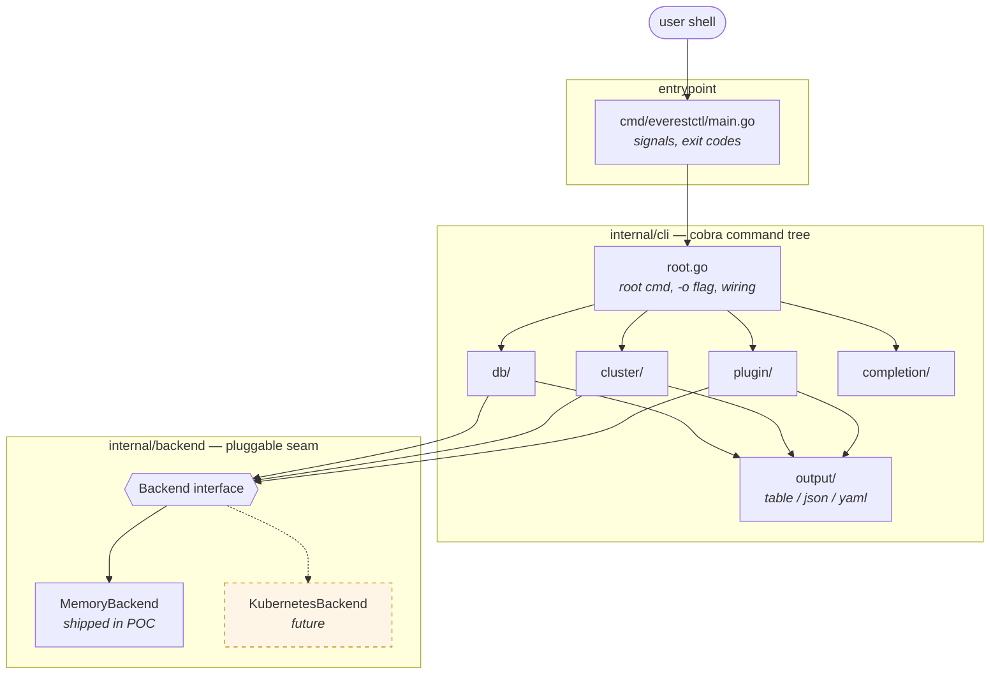
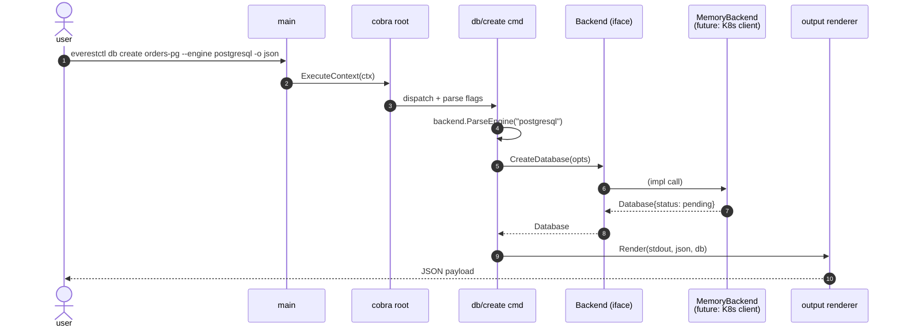

# everestctl POC

A proof-of-concept for the LFX mentorship project
**"CNCF - OpenEverest: Transform `everestctl` into a Powerful Database
Management CLI"** (2026 Term 2).

This POC implements the proposed command surface on top of a pluggable
backend interface. The shipped backend is in-memory, so every command is
runnable without a Kubernetes cluster — the real implementation later
swaps `internal/backend.MemoryBackend` for a Kubernetes / Everest API
client without touching the command layer.

## What the POC demonstrates

| Outcome from the project brief                         | Where it lives                         |
| ------------------------------------------------------ | -------------------------------------- |
| `db list / create / delete / get / logs`               | [`internal/cli/db`](internal/cli/db/db.go) |
| `cluster list / register / status`                     | [`internal/cli/cluster`](internal/cli/cluster/cluster.go) |
| `plugin list / install / configure`                    | [`internal/cli/plugin`](internal/cli/plugin/plugin.go) |
| Shell completion (bash / zsh / fish / powershell)      | [`internal/cli/completion`](internal/cli/completion/completion.go) |
| Multiple output formats (table / json / yaml)          | [`internal/cli/output`](internal/cli/output/output.go) |
| Pluggable backend seam (Kubernetes-ready)              | [`internal/backend`](internal/backend/backend.go) |
| Unit + integration tests (≥80% coverage)               | `*_test.go`, see below                 |

## Command tree



## Quickstart

```sh
go build -o bin/everestctl ./cmd/everestctl

./bin/everestctl db list
./bin/everestctl db list -o json
./bin/everestctl db create reports-mysql --engine mysql --version 8.0 --replicas 2
./bin/everestctl db get reports-mysql -o yaml
./bin/everestctl db logs orders-pg

./bin/everestctl cluster list
./bin/everestctl cluster register prod --endpoint https://k8s.prod.example.com --context prod

./bin/everestctl plugin list
./bin/everestctl plugin install pmm
./bin/everestctl plugin configure backup-s3 --set bucket=my-backups --set region=eu-west-1
```

Because the backend lives in memory, state does **not** persist across
process invocations of the binary — each run starts with the seeded
sample data. Inside a single process (e.g. a test, or a future REPL)
state behaves normally.

### Shell completion

```sh
# bash
source <(./bin/everestctl completion bash)

# zsh
./bin/everestctl completion zsh > "${fpath[1]}/_everestctl"

# fish
./bin/everestctl completion fish | source
```

Completion is wired for database names, engine choices, and shell
selection — see `examples/completion-demo.txt` for sample output.

## Architecture



The dashed `KubernetesBackend` block is the *only* thing the real
implementation adds — nothing in the `cli` tree changes.



Two design decisions worth flagging for the mentorship review:

1. **`backend.Backend` is the only seam the command layer depends on.**
   Adding a real Kubernetes-backed implementation is purely additive —
   the command tree, output formatting, and tests stay put.
2. **`Deps` structs instead of package-level globals.** Each command
   group receives an explicit `Deps{Backend, Out, Err, Format}` so tests
   can swap any of them. This is what makes the 88% coverage achievable
   without spinning up a real cluster.

## Tests & coverage

```sh
go test ./...
go test ./... -coverpkg=./internal/... -coverprofile=cover.out
go tool cover -func=cover.out | tail -1
# total:    (statements)    88.4%
```

Two layers of tests:

- `internal/backend/memory_test.go` — unit tests for the backend
  invariants (duplicate detection, namespace filtering, plugin
  lifecycle, log streaming, …).
- `internal/cli/cli_test.go` — integration tests that drive the root
  cobra command end-to-end (table / json / yaml output, required-flag
  enforcement, create→get→delete round trip, shell completion).

## Roadmap to the real implementation

| Phase | Work                                                                 |
| ----- | -------------------------------------------------------------------- |
| 1     | Replace `MemoryBackend` with a Kubernetes client using OpenEverest CRDs. |
| 2     | Add `--kubeconfig` / `--context` global flags, config file loader.   |
| 3     | Add `db backup` / `db restore` and async operation polling.          |
| 4     | Real plugin registry integration (OCI artifacts, Helm).              |
| 5     | Interactive prompts behind a `--interactive` flag for `delete`, `create`. |

## Reference

- Project brief: CNCF OpenEverest – Transform everestctl into a Powerful
  Database Management CLI (LFX 2026 Term 2).
- Issue tracker: https://github.com/openeverest/openeverest/issues/1818
